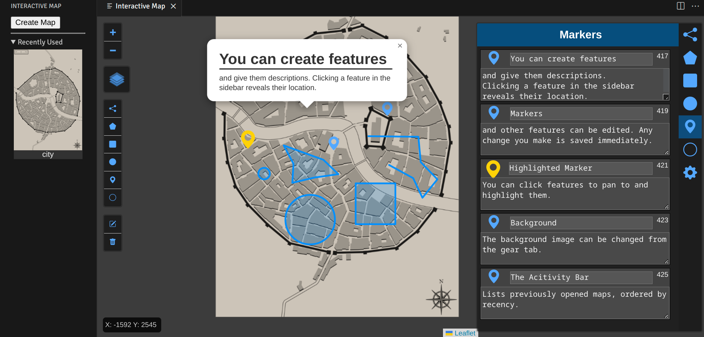

# Interactive Map

## Features

Create an interactive map with a custom background. Place various features with editable descriptions and names across a scrollable map.

Supported feature layers:

- Markers
- Circle Markers
- Polylines
- Polygons
- Rectangles
- Circles

Maps can be created from the activity bar icon, which also lists recently opened maps.
