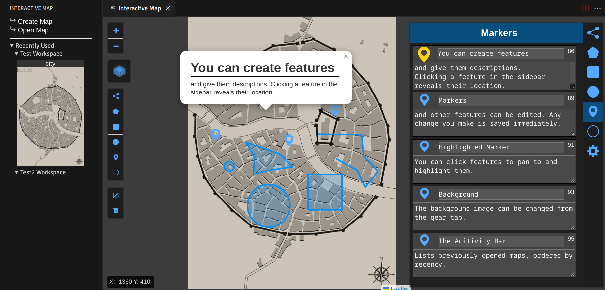

# Interactive Map

## Features

Create an interactive map with a custom background. Place various features with editable descriptions and names across a scrollable map.

Supported feature layers:

- Markers
- Circle Markers
- Polylines
- Polygons
- Rectangles
- Circles (Resizing them is not saved yet.)

Currently, maps have to be created with the 'Create Map' command, which expects a relative path.
Afterwards the map can be opened from the activity bar.
